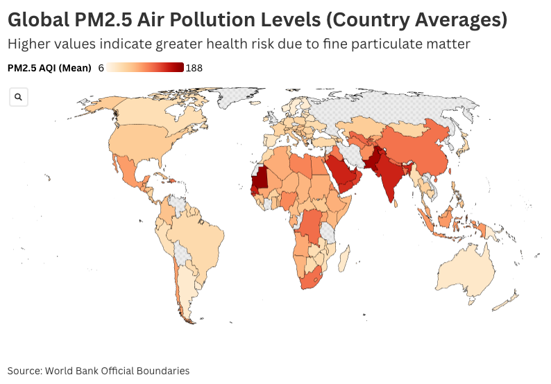
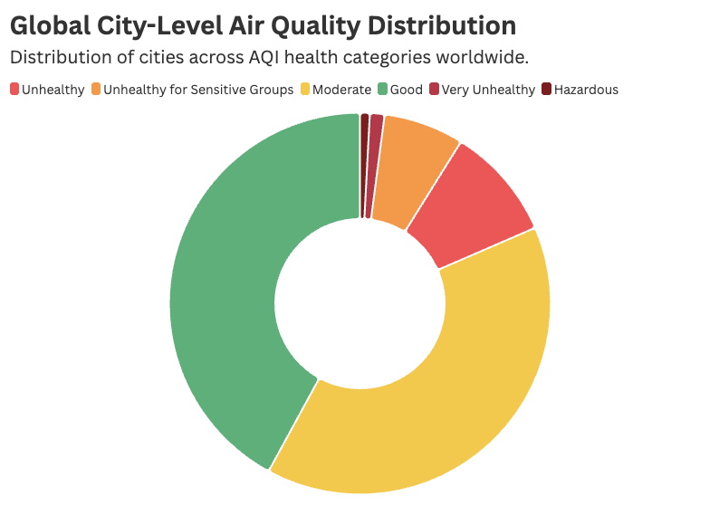
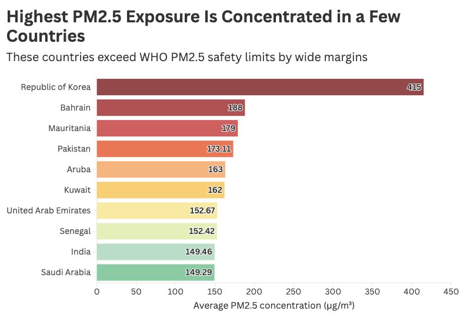
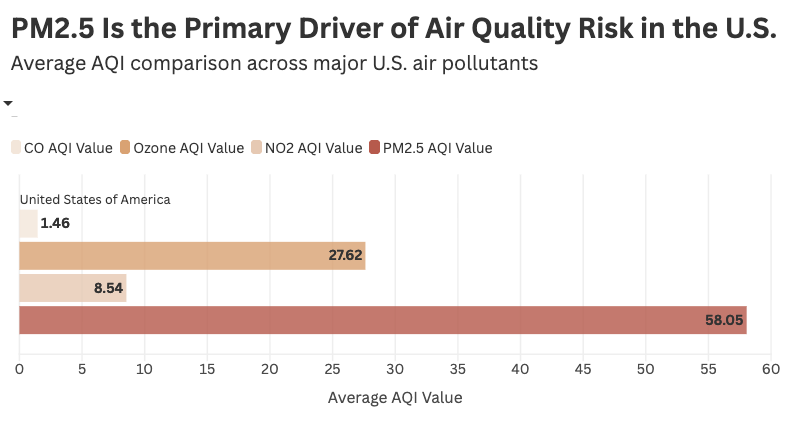

# WHO Air Pollution – Executive Storytelling System

⭐ 6-Week Canva Data Visualization & AI Design Externship Project

---

## 📌 Project Overview

This project develops an end-to-end air pollution analytics and executive storytelling system using the WHO Global Air Pollution dataset.

The workflow integrates:

Excel → Data Cleaning & Aggregation  
Flourish → Interactive Visual Analytics & Story Mode  
Canva → Reusable Executive Reporting Template  

The analysis moves from macro-level global exposure patterns to country benchmarking and city-level AQI distribution to uncover concentration clusters and dominant pollutant drivers.

---

## 🎯 Analytical Objective

Air pollution affects every region — but not equally.

This project explores:

- Global PM2.5 distribution
- Country-level exposure benchmarking
- City-level AQI category distribution
- Identification of dominant pollutant drivers
- Structured drill-down storytelling

---

## 🧮 Data & Statistical Approach

- Cleaned and standardized WHO dataset in Excel
- Calculated mean PM2.5 concentrations
- Calculated mean AQI values
- Aggregated data by global, country, and city levels
- Applied ranking and benchmarking logic
- Considered skew and limitations of mean values

---

## 🌍 Multi-Level Drill-Down Logic

1️⃣ Global projection map to identify regional clustering  
2️⃣ Country ranking to surface high exposure concentrations  
3️⃣ City-level AQI distribution to clarify hidden patterns  
4️⃣ Pollutant comparison to identify primary AQI driver  

Country-level alone was insufficient to fully explain patterns, so city-level segmentation provided deeper clarity.

---

## 🛠 Tools Used

- **Excel** (Cleaning & aggregation)
- **Flourish** (Interactive maps & charts)
- **Flourish Story Mode** (Narrative sequencing)
- **Canva** (Reusable executive template design)
- WHO Global Dataset

---

## 🧠 Key Insights

### 🌍 Uneven Global Exposure
Global PM2.5 exposure is not uniformly distributed. Geographic clustering reveals sustained high-concentration regions, indicating structural environmental disparities rather than random variation.

### 📊 Concentration Among a Limited Set of Countries
A relatively small group of countries consistently exceed global average PM2.5 levels, suggesting disproportionate contribution to overall exposure patterns.

### 🍩 City-Level Segmentation Reveals Hidden Risk
Country-level averages alone masked important variation. City-level AQI distribution clarified that while many cities fall under Moderate exposure, a smaller subset experiences severe or hazardous conditions.

### 🇺🇸 PM2.5 as a Primary AQI Driver
Pollutant comparison analysis indicates PM2.5 contributes significantly to overall AQI risk in the U.S., outweighing other monitored pollutants in relative impact.

---

## 📂 Repository Structure

- `/data` → Dataset source reference  
- `/docs` → Methodology documentation  
- `/template` → Reusable storytelling framework  
- `/assets` → Exported visual outputs  

---

## 🚀 What This Demonstrates

- Statistical aggregation & benchmarking
- Responsible interpretation of skewed environmental data
- Drill-down analytical reasoning
- Multi-tool visualization workflow
- Executive-ready storytelling system design

---

## 📸 Sample Visual Outputs

### 🌍 Global PM2.5 Distribution

### 📊 Country-Level Exposure Ranking

### 🍩 City-Level AQI Distribution

### 🇺🇸 U.S. Pollutant Driver Comparison

